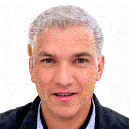

# Keep your finger on the PULSE of the super resolution
Explanatory implementation of _PULSE: Self-Supervised Photo Upsampling via Latent Space Exploration of Generative Models_ by S. Menon, A. Damian, S. Hu, N. Ravi.
CVPR 2020.

👉 [Interactive notebook](https://github.com/kainoj/keep-pulse/blob/master/pulse.ipynb) 👈|
[My medium.com article](https://medium.com/@joniak/keep-your-finger-on-the-pulse-of-the-super-resolution-5201a855e1a0) |
[PULSE: CVPR 2020 paper](https://openaccess.thecvf.com/content_CVPR_2020/papers/Menon_PULSE_Self-Supervised_Photo_Upsampling_via_Latent_Space_Exploration_of_Generative_CVPR_2020_paper.pdf)

---

👇

